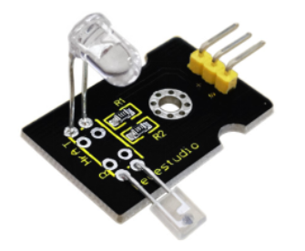
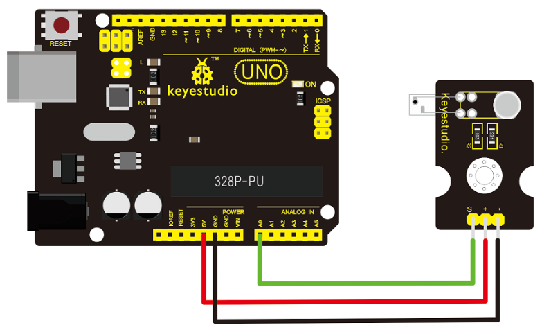

# KS0015 keyestudio Pulse Rate Monitor

## 1. Introduction

This module uses a ultra-bright infrared (IR) LED and a phototransistor to detect the pulse in your finger. The red LED then flashes in time with your pulse.

**Working principle:**

Shine the bright LED onto one side of your finger while the phototransistor on the other side of your finger picks up the amount of transmitted light.

The resistance of the phototransistor will vary slightly as the blood pulses through your finger.



## 2. Connection Diagram



## 3. Sample Code

Copy and paste the code below to Arduino software.

Download code:  [Code](./Code.7z)

```
int ledPin = 13;
int sensorPin = 0;
double alpha = 0.75;
int period = 20;
double change = 0.0;

void setup()
{
    pinMode(ledPin, OUTPUT);
    Serial.begin(115200);
}

void loop()
{
    static double oldValue = 0;
    static double oldChange = 0;
    int rawValue = analogRead(sensorPin);
    double value = alpha * oldValue + (1 - alpha) * rawValue;
    Serial.print(rawValue);
    Serial.print(",");
    Serial.println(value);
    oldValue = value;
    delay(period);
}
```

## 4. Result

Wire it up well as the above diagram, then upload well the code to the board and click the icon of serial monitor on the upper right corner of Arduino software.

Set the baud rate as 115200, you will see the data is displayed on the monitor. You can copy and paste the data to the excel, finally it will generate the corresponding picture shown below.


